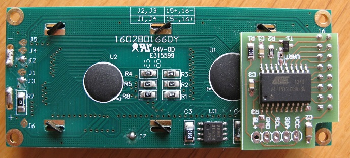

### Serial to HD44780

Although the Hitachi HD44780 LCD controller is old and its interface is not
particulary pleasant to work with, it's still used just about everywhere. I use
it a lot in my projects. So much so that I've decided to make this serial
interface to save myself the work of routing its parallel interface yet again.

To compile the sources my AVR library is required. For fuse
settings, take a look at the AVRDUDE_WRITE_FLASH variable in the makefile.

If PB4 is left floating (internal pullup), the selected interface is I2C (address 0x4c).
If PB4 is shorted to GND (solder jumper marked UART next to T1), the selected interface
is UART @ 9600 baud. When using UART, SCL equals chip's RX and SDA chip's TX (unused).

The protocol is byte oriented. Received bytes less than space (0x20) are command bytes,
others are considered characters and are output to the display as data.

#### Command bytes

Byte | Meaning
-----|--------
0x01 | go to start of line 1
0x02 | go to start of line 2
0x03 | go to start of line 3
0x04 | go to start of line 4
0x05 | init LCD
0x06 | clear LCD
0x07 | backlight ON
0x08 | backlight OFF
0x0d | clear the rest of the line from current cursor position (emulated cr)
0x0a | go to next line (emulated lf)

#### Bill of materials

Qty | Value / Farnell code | Device | Size | Parts
----|----------------------|--------|------|------
1 | 100n    | multilayer   | 0805   | C1
1 | 1u      | multilayer   | 1206   | C2
1 | 10n     | multilayer   | 0805   | C3
1 | 10R     | resistor     | 0805   | R1
1 | 2k      | resistor     | 0805   | R2
1 | 10k     | resistor     | 0805   | R3
1 | 1081260 | BC847        | SOT23  | T1
1 | 2446406 | ATtiny2313   | SO20L  | IC1

Resistor R1 is the backlight current limiting resistor and its value depends on your LCD's specs
and the BL+ voltage you will be using. LCD pin 3 (contrast) is left floating. Depending on your LCD,
you might need to connect a pot there.
